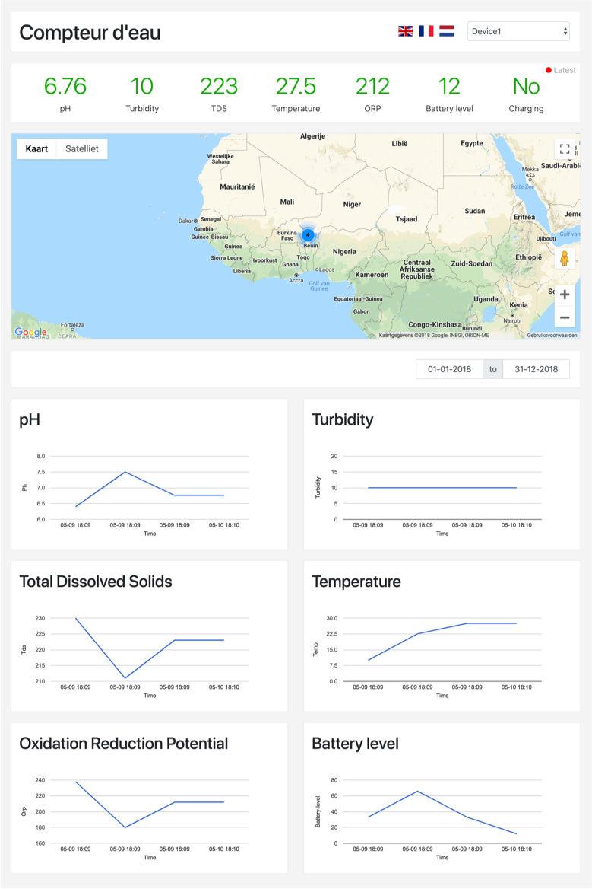

# Compteur-deau data dashboard

## Code information
Data dashboard for showing sensor data for the _Compteur d'eau_. The code than runs on the device can be found via: https://github.com/aoelen/compteur-deau-device. The dashboard is able to display sensor data and to store sensor data coming from the measurement device. 

### Storing data
In order to store data, the following path should be called: `/saveData`. The following GET parameters will be accepted, and saved: `ph, temp, tds, turbidity, gps, orp, battery-level, battery-charging, x, y, gps, ns`

An example request could look like this:
```/saveData?ph=7.23&temp=25.43&tds=213&turbidity=1&orp=201&battery-level=66&battery-charging=1&x=52.3538093567&y=4.7772049904&gps=0.72&ns=13.00```

### Additional information
#### Data being displayed:
- pH
- Turbidity
- Total Dissolved Solids
- Temperature
- Oxygen reduction Potential 
- Battery level
- Battery charging
- Location
- Date and time 

#### Supported languages:
- English
- French
- Dutch


#### Created using: 
- Laravel
- VueJS 
- Bootstrap 
- [vue-google-maps](https://github.com/heavyy/vue2-google-maps)
- [vue-charts](https://github.com/haydenbbickerton/vue-charts)

## Screenshot

