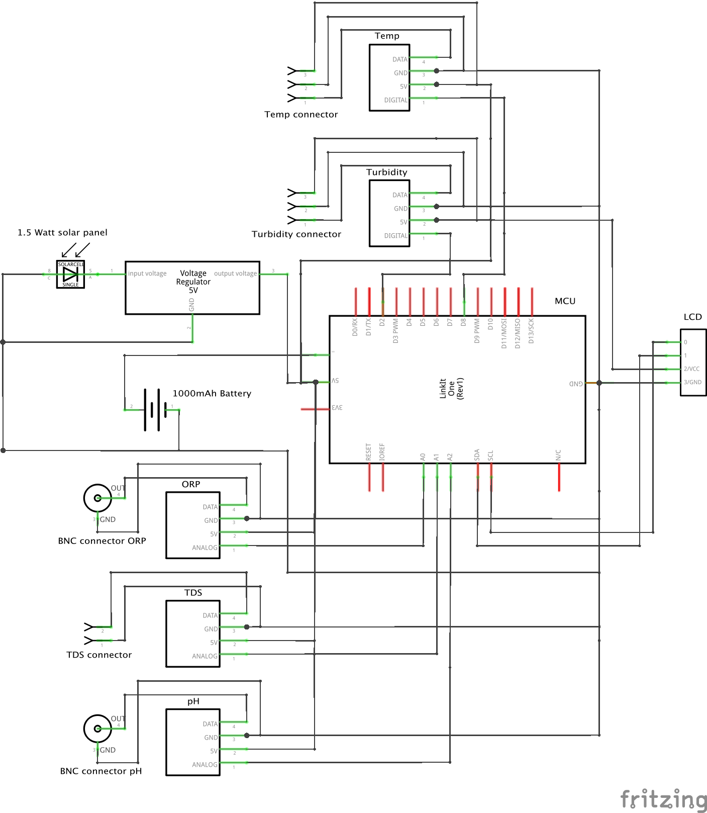
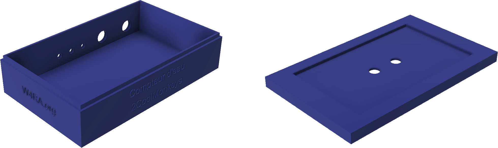
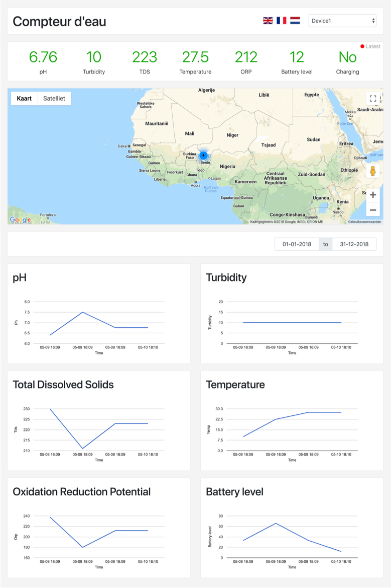

# Compteur-d'eau documentation

## Introduction 
Compteur d'eau is a device that is able to measure and monitor water quality using low-cost sensors within the context of rural Africa. The development of this device is part of a master thesis at the [Vrije Universiteit Amsterdam](http://vu.nl) and [2CoolMonkeys](https://www.2coolmonkeys.nl). The project focusses on how to design IoT devices for development areas. This is done by introducing a new methodology and by showing how to make informed design decisions. To demonstrate how to use this methodology, the IoT device Compteur d'eau has been constructed.

## About the device
The Compteur d'eau is able to measure and monitor water quality parameters. This is done by using low-cost sensors. The device has been designed to operate within rural areas of Africa, which means this project is part of an ICT for Development (ICT4D) context. Since the device can be used as an IoT device, this research can be called an IoT4D project. Using low-cost and mostly open-source sensors, the device is able to monitor water quality. Summarizing some of the key features of the device:
- Measuring water quality with low-cost sensors
- Designed to operate within the context of rural Africa 
- Measures the following water quality parameters: pH, Temperature, Total Dissolved Solids (TDS), Oxidation Reduction Potential (ORP), Turbidity
- Sending data using GPRS/WiFi to a cloud environment
- Robust software design (when one sensor breaks, the rest keeps working)

### Components
The main unit of the device is the LinkIt One. This board controls the incoming sensor data. Dependent on the device settings, the sensor data is uploaded to the cloud using WiFi or GPRS. Sensor data can also be stored on the device itself (on the internal storage or the SD card).

| Type                      | Description                          |
|---------------------------|--------------------------------------|
| Haoshi H-101              | Industrial pH sensor                 |
| LinkIt One                | Development board for sensor control |
| DFRobot analog TDS sensor | TDS sensor                           |
| DS18B20                   | Temperature sensor                   |
| TSD-10                    | Turbidity sensor                     |
| DFRobot ORP sensor        | ORP sensor                           |
| Seeed Studio Solar panel  | 1.5W Solar panel                     |

In addition to the components list some small parts are needed. This includes wires and pin connectors. In order to fully assemble the device, a soldering iron is needed.

### Schematics
In the figure below, a high-level overview of how the components are connected is displayed. Two of the five sensors are connected using BNC connectors (depicted as a circle) and the other three sensors are connected using pin connectors. 

[View full screen image](img/schematics.png)

### Housing
The housing of the device has been designed with Autodesk Fusion 360. Afterwards the design has been printed with an Ultimaker 2+ 3D printer. The figure below shows the renders of the device. A solar panel can be installed on top of the lid. The source of the design [can be downloaded via the Autodesk website](https://a360.co/2QzWFr4). The STL file can be [downloaded directly from here](files/device-design.stl). To print the design, download the STL file and send it to your 3D printer.

### Code

#### Device code
The code that runs on the LinkIt One can be found in the [Compteur D'eau device repository](https://github.com/aoelen/compteur-deau-device). The code can be compiled and installed with the Arduino IDE. Below, the settings of the device are listed. These settings can be found in the `main.ino` file. Additional information about the code can be found in the Readme file of the mentioned repository. 

| Type                      | Description                                                                                                                                           | Default value                                                                  |
|---------------------------|-------------------------------------------------------------------------------------------------------------------------------------------------------|--------------------------------------------------------------------------------|
| TEMPERATURE_PIN           | Digital pin on the LinkIt One where the temperature sensor is connected to                                                                            | 8                                                                              |
| PH_PIN                    | Analog pin on the LinkIt One where the pH sensor is connected to                                                                                      | A2                                                                             |
| TDS_PIN                   | Analog pin on the LinkIt One where the pH sensor is connected to                                                                                      | A1                                                                             |
| ORP_PIN                   | Analog pin on the LinkIt One where the ORP sensor is connected to                                                                                     | A0                                                                             |
| TURBIDITY_PIN             | Digital pin on the LinkIt One where the Turbidity sensor is connected to                                                                              | 2                                                                              |
| SAFETY_THRESHOLD_TDS      | The drinking water standard with respect to TDS, used for the LCD screen. When TDS is higher than threshold, a warning appears                        | 600                                                                            |
| SAFETY_THRESHOLD_PH_LOWER | The drinking water standard with respect to PH, used for the LCD screen. A warning appears when the pH is below this threshold value                  | 6.5                                                                            |
| SAFETY_THRESHOLD_PH_UPPER | The drinking water standard with respect to PH, used for the LCD screen. A warning appears when the pH is above this threshold value                  | 8.5                                                                            |
| STORE_DATA_LOCALLY        | When set to true, sensor data is saved to local storage                                                                                               | true                                                                           |
| Drv                       | If STORE_DATA_LOCALLY = true, select the location where the data should be stored. LSD = SD card, LFlash = internal 10M flash memory                  | LSD                                                                            |
| CLOUD_STORAGE_IP          | IP address or hostname of the cloud server storage                                                                                                    | 35.205.42.150                                                                  |
| CLOUD_STORAGE_PATH        | Path of the cloud server storage                                                                                                                      | /compteur-deau-prototype.php                                                   |
| SENSOR_LABELS             | The labels of the sensor values that need to be registered                                                                                            | {"temp", "ph", "tds", "orp", "battery-level", "battery-charging", "turbidity"} |
| SENSOR_VALUE_AMOUNT       | )The amount of sensor values that need to be registered (usually the amount of sensor labels provided in SENSOR_LABELS                                | 7                                                                              |
| WIFI_ENABLE               | Enable sending sensor data via WiFi to the cloud server                                                                                               | false                                                                          |
| WIFI_AP                   | WiFi access point name                                                                                                                                | -                                                                              |
| WIFI_PASSWORD             | WiFi password                                                                                                                                         | -                                                                              |
| WIFI_AUTH                 | WiFi authentication type. Choose from: LWIFI_OPEN, LWIFI_WPA, or LWIFI_WEP                                                                            | LWIFI_WPA                                                                      |
| INTERVAL_WIFI             | The interval of sending the data via WiFi. Provide the amount in milliseconds. The smaller the interval, the more battery is used                     | 900.000                                                                        |
| GPRS_ENABLE               | Enable sending sensor data via GPRS to the cloud server                                                                                               | true                                                                           |
| APN                       | Acces Point Name of GPRS provider                                                                                                                     | -                                                                              |
| LOGIN                     | Login of GPRS provider                                                                                                                                | -                                                                              |
| PASSWORD                  | Password of GPRS provider                                                                                                                             | -                                                                              |
| INTERVAL_GPRS             | The interval of sending the data via GPRS. Provide the amount in milliseconds. The smaller the interval, the more battery is used                     | 900.000                                                                        |
| INTERVAL_GPS              | The interval in which the GPS coordinates need to be reloaded. Provide the amount in milliseconds. The smaller the interval, the more battery is used | 900.000                                                                        |

#### Dashboard code
The dashboard code is written in PHP using the Laravel framework. The dashboard can be used to display the recorded sensor data. In addition to this, the dashboard can be used to record the data. Recording data is done by sending a GET request, for example: `/saveData?ph=7.23&temp=25.43&tds=213&turbidity=1&orp=201&battery-level=66&battery-charging=1&x=52.3538093567&y=4.7772049904&gps=0.72&ns=13.00` The code can be found online in [this repository](https://github.com/aoelen/compteur-deau). Additional information about the code can be found in the Readme file of the mentioned repository. 

